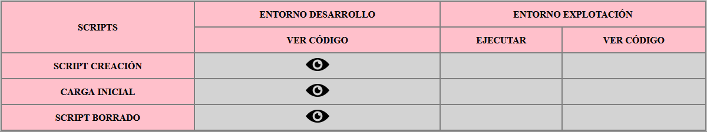
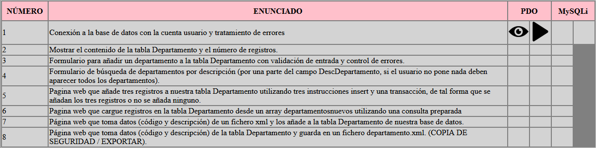

# AHFDWESProyectoTema4

Repositorio que almacena el Proyecto del Tema 4 de la asignatura de Desarrollo Web Entorno Cliente, contiene
los ejercicios en php del resultado de aprendizaje de conexión a la base de datos MariaDB, ademas los ejercicios estan
realizados tanto en PDO como en MySQLi.

## Guía de instalación

Para poder ejecutar y ver el código de los ejercicios necesitamos una serie de requisitos:

> Servidor Apache.\
> Módulo php-fpm instlado en Apache.\
> Módulo MariaDB instlado en Apache. \
> Entorno de desarrollo en el cual ejecutar los scripts de la base de datos. (/scripts)\
> Navegador para poder ejecutar el indexProyectoTema4.php\ 

## Guía de uso 

Todo el uso del proyecto se podra ejecutar desde el indexProyectoTema4.php, pero
también debemos tener en cuenta la ejecucción de los scripts de creacion , carga y eliminación de la base de datos.

1- Ejecucción de los scripts de creación y carga de la carpeta scripts (Nos crearan y rellenaran la base de datos).\
2- Iniciamos el navegador con la ip de nuestro servidor apache y la dirección del index.\
3- En cuanto al index veremos dos tablas bien diferenciadas:\

### Tabla con los scripts de la Base de Datos: 

Como podemos ver en la tabla scripts tenemos la opcion de ver el código de cada script.\
Solamente podemos ejecutar el ver código en el entorno de desarrollo (En el que nos encontramos).

### Tabla con los ejercicios PHP:

En la tabla ejercicios podemos distinguir dos zonas a la derecha PDO y MySQLi, \
cada una nos permitira ejecutar el ejercicio para ver su funcionalidad y ver el codigo del archivo .php

## Estructura de archivos: 

La estructura de archivos dentro del proyecto esta distribuida de la siguiente manera: 

#### /codigoPHP (Almacena los index de cada ejercicio, con la lógica de programación).
#### /doc/images (Carpeta que almacena las imagenes utilizadas en todo el proyecto).
#### /mostrarcodigo (Carpeta que almacena los archivos con el código para poder verlo en el navegador).
#### /scriptDB (Carpeta que almacena los scripts de la Base de Datos).
#### /webroot/css (Carpeta que almacena los estilos del indexProyectoTema4.php).
#### indexProyectoTema4.php (archivo mediant el cual se ejecuta todo el proyecto en el navegador).

## Guía de contribución en el proyecto.

Para contribuir en nuevas funcionalidades , correcciones o implementaciones en el código estate atento a nuevas Issues que pondremos mas adelante para poder mejorar el proyecto.

## Autor

Alejandro De la Huerga Fernández.